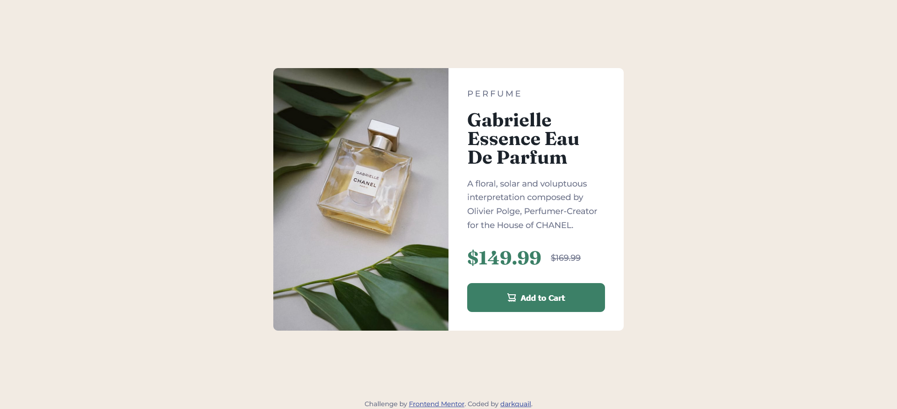

# Frontend Mentor - Product preview card component solution

This is a solution to the [Product preview card component challenge on Frontend Mentor](https://www.frontendmentor.io/challenges/product-preview-card-component-GO7UmttRfa). 

## Table of contents

- [Overview](#overview)
  - [The challenge](#the-challenge)
  - [Screenshot](#screenshot)
  - [Links](#links)
- [My process](#my-process)
  - [Built with](#built-with)
  - [What I learned](#what-i-learned)

## Overview

### The challenge

Users should be able to:

- View the optimal layout depending on their device's screen size
- See hover and focus states for interactive elements

### Screenshot

### Links

- Solution URL: [Add solution URL here](https://github.com/darkquail/product-preview-card-component)
- Live Site URL: [Add live site URL here](https://darkquail.github.io/product-preview-card-component/index.html)

## My process

### Built with

- Semantic HTML5 markup
- CSS custom properties
- Flexbox
- CSS Grid
- Mobile-first workflow

### What I learned

Maybe it's kinda overkill to use grid but time i tried arrange my elements using grid instead of using `margin-bottom:` to incrase consistency because i use css reset of `margin:0` so i have full control on every spacing between each elements.

This time i also use `<source srcset="./images/image-product-desktop.jpg" media="(min-width: 600px)" />` to make sure the picture shifting files when the screen size changing. Because there's 2 different picture that used for desktop and mobile.
